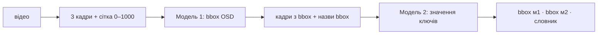

# Автоматична детекція, відокремлення та парсинг OSD з відеопотоку БПЛА

Двостадійний пайплайн на vision-LLM (`qwen/qwen3.8-flash` через [OpenRouter](https://openrouter.ai)).
Він знаходить на відео з БПЛА елементи OSD (on-screen display), **відокремлює** їх від сцени і **зчитує**
телеметрію у словник із 25 ключів.



1. **Кадри.** З відео беруться 3 кадри на рівних відстанях. На них малюється координатна сітка 0–1000
   без падінгів: напівпрозорі лінії й цифри, які модель використовує як лінійку.
2. **Модель 1 — детекція.** На вході few-shot приклади з `few_shots/` і кадри із сіткою. OSD статичний,
   а сцена рухається, тому модель повертає один набір bbox на все відео: `x_min,y_min,x_max,y_max,label`.
3. **Модель 2 — парсинг.** На вході кадри з напівпрозорими bbox моделі 1 і каталог їхніх назв. Модель
   повертає значення кожного ключа з кожного кадру — дослівно, з одиницями, разом із назвою bbox.
   Якщо значення немає або модель у ньому не впевнена — `null`. Після цього лишаються тільки bbox, з
   яких зчитано значення.

### Ключі моделі 2

| ключ | опис |
|---|---|
| `latitude` / `longitude` | широта / довгота поточної позиції |
| `gps_status` | стан позиціонування: NO GPS, 2D FIX, 3D FIX тощо |
| `gps_satellites_count` | кількість супутників |
| `altitude` | висота з одиницями виміру |
| `altitude_reference` | відлік висоти: relative, msl, agl (невідомо → null) |
| `heading` | курс у градусах: цифри, стрічка компаса або кут на циферблаті (`180°`) |
| `ground_speed` | швидкість відносно землі |
| `airspeed` | повітряна швидкість |
| `speed` | швидкість, тип якої не визначити |
| `vertical_speed` | швидкість набору / зниження |
| `distance_to_home` | відстань до точки старту |
| `distance_travelled` | пройдений шлях |
| `osd_date` | дата, яку показує OSD |
| `osd_clock_time` | час доби (не тривалість польоту) |
| `flight_time` | таймер, явно позначений як час польоту |
| `osd_timer` | таймер невідомого призначення |
| `flight_mode` | режим польоту: AIR, FBWA, N тощо |
| `armed` | явно показаний стан ARMED / DISARMED |
| `battery_voltage` | загальна напруга батареї |
| `cell_voltage` | напруга однієї банки |
| `battery_remaining_pct` | залишок заряду, % |
| `battery_current` | струм споживання |
| `throttle_pct` | рівень газу, % |
| `warnings` | попередження: LAND NOW, low voltage тощо |

## Встановлення

```bash
pip install -r requirements.txt   # і ffmpeg у системі
```

Встав ключ OpenRouter у файл `.env` (зразок — `.env.example`):

```
OPENROUTER_API_KEY=sk-or-v1-...
```

## Використання

- `osd_pipeline.ipynb` — покроковий запуск на одному відео з `videos/` з візуалізацією кожного етапу.
- `osd_all_videos.ipynb` — інференс і візуалізація результатів для всіх відео з `videos/`.

```python
from osd.pipeline import infer_video

res = infer_video("IMG_3812.MP4")
res["m1_bboxes"]  # усі OSD-елементи: [{x_min, y_min, x_max, y_max, label}] у шкалі 0–1000
res["m2_bboxes"]  # лише bbox, з яких зчитано значення
res["readings"]   # {"altitude": {"values": ["28", "28", "27"], "bbox_name": "..."}, ...}
```

```bash
python -m osd.pipeline IMG_3812.MP4
```

Гіперпараметри зібрані в `osd/constants.py`.

## Структура

```
videos/  few_shots/  outputs/ (не в git)
osd/
├── constants.py          # шляхи, моделі, гіперпараметри
├── openrouter.py         # виклики OpenRouter
├── extract_frames.py     # рівномірні кадри з відео
├── grid.py               # сітка без падінгів
├── frames_to_content.py  # кадри → вхід моделі
├── image_utils.py        # зображення: JPEG/base64, показ
├── bbox_draw.py          # малювання bbox
├── prompt_model1.py      # промпт моделі 1 + побудова + парсер
├── prompt_model2.py      # промпт моделі 2 + ключі + побудова + парсер
├── model1.py / model2.py # моделі
├── pipeline.py           # повний інференс без візуалізації
├── viz_prompt.py         # промпт із зображеннями
├── viz_model1.py / viz_model2.py  # результати моделі 1 / 2
├── viz_results.py        # повні результати
└── bbox_video.py         # bbox на відео + GIF
```

## Результати

16 відео з `videos/`, `qwen/qwen3.8-flash` (reasoning low), успішно 16/16:

| | модель 1 | модель 2 | разом |
|---|---|---|---|
| час на відео | 66.5 с | 130.4 с | 197.3 с |
| ціна на відео | $0.0018 | $0.0043 | ≈ $0.006 |

Час і ціна — середні по 16 відео. На кожне відео до кожної моделі робилося 3 запити, у цифрах
врахований перший успішний із них.
